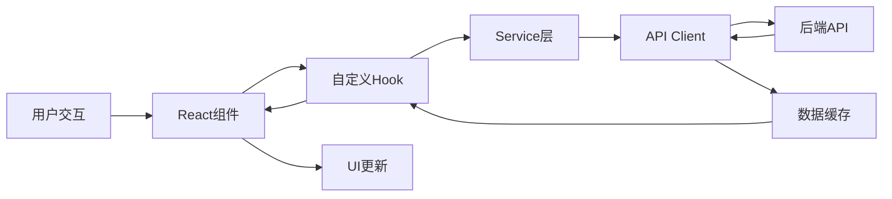

# React后台管理系统 - 技术设计文档

## 概述

React后台管理系统是一个现代化的单页应用（SPA），采用React 18+构建，为管理员提供完整的后台管理功能。系统采用组件化架构，支持响应式设计，并实现了基于角色的权限控制。

### 核心目标

- 提供直观、高效的管理界面
- 确保数据安全和访问控制
- 支持多设备访问（桌面、平板、移动）
- 实现可扩展的模块化架构
- 提供良好的用户体验和错误处理

### 技术栈

**前端框架与库:**
- React 18.x - UI框架
- React Router v6 - 路由管理
- TypeScript - 类型安全
- Ant Design / Material-UI - UI组件库
- Recharts / Chart.js - 数据可视化
- Axios - HTTP客户端
- React Query / SWR - 数据获取和缓存
- Zustand / Redux Toolkit - 状态管理
- React Hook Form - 表单管理
- Zod / Yup - 表单验证

**开发工具:**
- Vite - 构建工具
- ESLint + Prettier - 代码规范
- Vitest - 单元测试
- fast-check - 属性测试
- React Testing Library - 组件测试

## 架构

### 整体架构

系统采用分层架构设计，从上到下分为：

```
┌─────────────────────────────────────────┐
│         展示层 (Presentation)            │
│  Pages, Components, Layouts             │
├─────────────────────────────────────────┤
│         业务逻辑层 (Business Logic)      │
│  Hooks, Services, State Management      │
├─────────────────────────────────────────┤
│         数据访问层 (Data Access)         │
│  API Client, Data Fetching, Cache       │
├─────────────────────────────────────────┤
│         基础设施层 (Infrastructure)      │
│  Auth, Router, Error Boundary, Utils    │
└─────────────────────────────────────────┘
```

### 目录结构

```
src/
├── components/          # 可复用组件
│   ├── common/         # 通用组件（Button, Input等）
│   ├── layout/         # 布局组件（Header, Sidebar, Footer）
│   └── business/       # 业务组件（UserTable, Dashboard等）
├── pages/              # 页面组件
│   ├── Login/
│   ├── Dashboard/
│   ├── Users/
│   └── Error/
├── hooks/              # 自定义Hooks
│   ├── useAuth.ts
│   ├── usePermission.ts
│   └── useApi.ts
├── services/           # API服务
│   ├── auth.service.ts
│   ├── user.service.ts
│   └── api.client.ts
├── store/              # 状态管理
│   ├── authStore.ts
│   └── userStore.ts
├── types/              # TypeScript类型定义
│   ├── user.types.ts
│   ├── auth.types.ts
│   └── api.types.ts
├── utils/              # 工具函数
│   ├── validation.ts
│   ├── storage.ts
│   └── format.ts
├── router/             # 路由配置
│   ├── index.tsx
│   └── ProtectedRoute.tsx
└── constants/          # 常量定义
    ├── permissions.ts
    └── config.ts
```

### 数据流



## 组件和接口

### 核心组件

#### 1. 认证组件

**LoginForm**
```typescript
interface LoginFormProps {
  onSuccess: (token: string) => void;
  onError: (error: Error) => void;
}

// 功能：处理用户登录
// 职责：表单验证、提交登录请求、错误处理
```

**ProtectedRoute**
```typescript
interface ProtectedRouteProps {
  children: React.ReactNode;
  requiredPermissions?: string[];
}

// 功能：保护需要认证的路由
// 职责：验证令牌、检查权限、重定向未授权用户
```

#### 2. 布局组件

**MainLayout**
```typescript
interface MainLayoutProps {
  children: React.ReactNode;
}

// 功能：提供主布局结构
// 组成：Header + Sidebar + Content + Footer
```

**Sidebar**
```typescript
interface SidebarProps {
  collapsed: boolean;
  onCollapse: (collapsed: boolean) => void;
  menuItems: MenuItem[];
}

// 功能：侧边导航菜单
// 职责：显示菜单项、处理导航、响应式折叠
```

#### 3. 数据展示组件

**DataTable**
```typescript
interface DataTableProps<T> {
  data: T[];
  columns: ColumnDef<T>[];
  loading?: boolean;
  pagination?: PaginationConfig;
  onSort?: (field: string, order: 'asc' | 'desc') => void;
  onFilter?: (filters: Record<string, any>) => void;
}

// 功能：通用数据表格
// 职责：数据展示、排序、筛选、分页
```

**DashboardCard**
```typescript
interface DashboardCardProps {
  title: string;
  value: number | string;
  icon: React.ReactNode;
  trend?: {
    value: number;
    direction: 'up' | 'down';
  };
}

// 功能：仪表盘指标卡片
// 职责：展示关键指标和趋势
```

#### 4. 表单组件

**UserForm**
```typescript
interface UserFormProps {
  initialValues?: User;
  onSubmit: (values: UserFormData) => Promise<void>;
  onCancel: () => void;
}

// 功能：用户创建/编辑表单
// 职责：表单验证、数据提交、错误处理
```

### 服务接口

#### API Client

```typescript
interface ApiClient {
  get<T>(url: string, config?: RequestConfig): Promise<T>;
  post<T>(url: string, data: any, config?: RequestConfig): Promise<T>;
  put<T>(url: string, data: any, config?: RequestConfig): Promise<T>;
  delete<T>(url: string, config?: RequestConfig): Promise<T>;
}

interface RequestConfig {
  headers?: Record<string, string>;
  timeout?: number;
  params?: Record<string, any>;
}
```

#### Auth Service

```typescript
interface AuthService {
  login(credentials: LoginCredentials): Promise<AuthResponse>;
  logout(): Promise<void>;
  refreshToken(): Promise<string>;
  validateToken(token: string): boolean;
}

interface LoginCredentials {
  username: string;
  password: string;
}

interface AuthResponse {
  token: string;
  user: User;
  expiresIn: number;
}
```

#### User Service

```typescript
interface UserService {
  getUsers(params: UserQueryParams): Promise<PaginatedResponse<User>>;
  getUserById(id: string): Promise<User>;
  createUser(data: CreateUserData): Promise<User>;
  updateUser(id: string, data: UpdateUserData): Promise<User>;
  deleteUser(id: string): Promise<void>;
}

interface UserQueryParams {
  page?: number;
  pageSize?: number;
  search?: string;
  role?: string;
  status?: string;
}
```

### 自定义Hooks

#### useAuth

```typescript
interface UseAuthReturn {
  user: User | null;
  token: string | null;
  isAuthenticated: boolean;
  login: (credentials: LoginCredentials) => Promise<void>;
  logout: () => void;
  isLoading: boolean;
  error: Error | null;
}

function useAuth(): UseAuthReturn;
```

#### usePermission

```typescript
interface UsePermissionReturn {
  hasPermission: (permission: string) => boolean;
  hasAnyPermission: (permissions: string[]) => boolean;
  hasAllPermissions: (permissions: string[]) => boolean;
  userRole: string | null;
}

function usePermission(): UsePermissionReturn;
```

#### useDataTable

```typescript
interface UseDataTableReturn<T> {
  data: T[];
  loading: boolean;
  error: Error | null;
  pagination: PaginationState;
  sorting: SortingState;
  filters: FilterState;
  setPage: (page: number) => void;
  setPageSize: (size: number) => void;
  setSorting: (field: string, order: 'asc' | 'desc') => void;
  setFilters: (filters: Record<string, any>) => void;
  refetch: () => void;
}

function useDataTable<T>(
  fetchFn: (params: any) => Promise<PaginatedResponse<T>>,
  options?: DataTableOptions
): UseDataTableReturn<T>;
```

## 数据模型

### 用户模型

```typescript
interface User {
  id: string;
  username: string;
  email: string;
  role: UserRole;
  status: UserStatus;
  avatar?: string;
  createdAt: string;
  updatedAt: string;
  lastLoginAt?: string;
}

enum UserRole {
  ADMIN = 'admin',
  USER = 'user',
  VIEWER = 'viewer'
}

enum UserStatus {
  ACTIVE = 'active',
  INACTIVE = 'inactive',
  SUSPENDED = 'suspended'
}

interface CreateUserData {
  username: string;
  email: string;
  password: string;
  role: UserRole;
}

interface UpdateUserData {
  username?: string;
  email?: string;
  role?: UserRole;
  status?: UserStatus;
}
```

### 认证模型

```typescript
interface AuthToken {
  accessToken: string;
  refreshToken?: string;
  expiresAt: number;
  tokenType: 'Bearer';
}

interface AuthState {
  token: AuthToken | null;
  user: User | null;
  isAuthenticated: boolean;
}
```

### 仪表盘数据模型

```typescript
interface DashboardStats {
  totalUsers: number;
  activeUsers: number;
  todayVisits: number;
  systemStatus: 'healthy' | 'warning' | 'error';
}

interface UserGrowthData {
  date: string;
  count: number;
}

interface DashboardData {
  stats: DashboardStats;
  userGrowth: UserGrowthData[];
  period: {
    start: string;
    end: string;
  };
}
```

### 表格数据模型

```typescript
interface PaginatedResponse<T> {
  data: T[];
  pagination: {
    page: number;
    pageSize: number;
    total: number;
    totalPages: number;
  };
}

interface ColumnDef<T> {
  key: string;
  title: string;
  dataIndex: keyof T;
  sortable?: boolean;
  filterable?: boolean;
  render?: (value: any, record: T) => React.ReactNode;
  width?: number | string;
}

interface SortingState {
  field: string | null;
  order: 'asc' | 'desc' | null;
}

interface FilterState {
  [key: string]: any;
}

interface PaginationState {
  page: number;
  pageSize: number;
  total: number;
}
```

### API响应模型

```typescript
interface ApiResponse<T> {
  success: boolean;
  data: T;
  message?: string;
  timestamp: string;
}

interface ApiError {
  success: false;
  error: {
    code: string;
    message: string;
    details?: any;
  };
  timestamp: string;
}
```

### 表单验证模型

```typescript
interface ValidationRule {
  required?: boolean;
  minLength?: number;
  maxLength?: number;
  pattern?: RegExp;
  custom?: (value: any) => boolean | string;
}

interface FieldError {
  field: string;
  message: string;
}

interface FormState<T> {
  values: T;
  errors: Record<keyof T, string>;
  touched: Record<keyof T, boolean>;
  isValid: boolean;
  isSubmitting: boolean;
}
```

### 权限模型

```typescript
interface Permission {
  id: string;
  name: string;
  resource: string;
  action: 'create' | 'read' | 'update' | 'delete';
}

interface RolePermissions {
  role: UserRole;
  permissions: Permission[];
}

// 权限常量
const PERMISSIONS = {
  USER_CREATE: 'user:create',
  USER_READ: 'user:read',
  USER_UPDATE: 'user:update',
  USER_DELETE: 'user:delete',
  DASHBOARD_VIEW: 'dashboard:view',
} as const;
```


## 正确性属性

属性是系统所有有效执行中应该保持为真的特征或行为——本质上是关于系统应该做什么的形式化陈述。属性作为人类可读规范和机器可验证正确性保证之间的桥梁。

### 属性 1: 有效凭据认证成功

*对于任何*有效的用户名和密码组合，调用登录函数应该返回一个有效的访问令牌，且该令牌能够通过令牌验证函数。

**验证需求: 1.1**

### 属性 2: 无效凭据认证失败

*对于任何*无效的凭据（空用户名、空密码、错误格式、不匹配的凭据），登录函数应该拒绝访问并返回包含错误消息的错误响应。

**验证需求: 1.2**

### 属性 3: 过期令牌被拒绝

*对于任何*过期的访问令牌，当用户尝试访问受保护资源时，系统应该拒绝请求并要求重新认证。

**验证需求: 1.3**

### 属性 4: 令牌存储往返一致性

*对于任何*有效的访问令牌，将其保存到本地存储后再读取，应该得到相同的令牌值。

**验证需求: 1.4**

### 属性 5: 登出清除认证状态

*对于任何*已认证的用户会话，执行登出操作后，本地存储中的令牌应该被清除，且isAuthenticated状态应该变为false。

**验证需求: 1.5**

### 属性 6: 菜单项点击更新导航状态

*对于任何*有效的菜单项，点击该菜单项应该导致：(1) 该菜单项被标记为选中状态，(2) 路由路径更新为对应的页面路径。

**验证需求: 2.2**

### 属性 7: 面包屑反映当前路由

*对于任何*有效的路由路径，面包屑组件应该生成与该路径层级结构对应的导航链接序列。

**验证需求: 2.5**

### 属性 8: 响应式菜单断点切换

*对于任何*视口宽度，当宽度小于768像素时，导航菜单应该切换为折叠模式；当宽度大于等于768像素时，应该显示为展开模式。

**验证需求: 2.4**

### 属性 9: 仪表盘数据时间范围正确

*对于任何*仪表盘数据请求，返回的数据应该只包含最近30天内的记录，即所有数据点的日期应该在[今天-30天, 今天]范围内。

**验证需求: 3.1**

### 属性 10: 数据加载失败显示错误UI

*对于任何*导致数据加载失败的错误（网络错误、服务器错误等），仪表盘应该显示错误提示消息和重试按钮。

**验证需求: 3.4**

### 属性 11: 加载状态正确显示

*对于任何*数据加载操作，在数据请求开始到完成之间的时间段内，loading状态应该为true，且加载指示器应该可见。

**验证需求: 3.5**

### 属性 12: 用户表格渲染所有字段

*对于任何*用户对象列表，表格渲染后应该为每个用户显示姓名、邮箱、角色和状态字段，且渲染的值应该与原始数据匹配。

**验证需求: 4.1**

### 属性 13: 用户搜索过滤正确

*对于任何*用户列表和搜索关键词，搜索结果应该只包含姓名或邮箱中包含该关键词的用户（不区分大小写）。

**验证需求: 4.2**

### 属性 14: 创建用户后列表更新

*对于任何*有效的用户数据，成功创建用户后，刷新的用户列表应该包含新创建的用户，且列表长度应该增加1。

**验证需求: 4.4**

### 属性 15: 编辑表单预填充正确

*对于任何*现有用户，点击编辑按钮后显示的表单应该预填充该用户的所有当前字段值。

**验证需求: 4.5**

### 属性 16: 删除用户后列表更新

*对于任何*用户列表中的用户，确认删除该用户后，刷新的列表应该不再包含该用户，且列表长度应该减少1。

**验证需求: 4.6**

### 属性 17: 分页正确分割数据

*对于任何*用户列表，当设置每页10条记录时，每页显示的用户数应该不超过10条，且所有页面的用户总数应该等于总用户数。

**验证需求: 4.7**


### 属性 18: 表格排序正确性

*对于任何*数据列表和可排序列，点击列标题进行排序后，结果应该按照该列的值正确排序（升序或降序），且排序后的数据应该保持完整（无数据丢失或重复）。

**验证需求: 5.1**

### 属性 19: 表格列显示排序和筛选UI

*对于任何*表格列配置，如果列标记为可排序，应该显示排序指示器；如果标记为可筛选，应该显示筛选输入框。

**验证需求: 5.2, 5.3**

### 属性 20: 表格筛选匹配正确

*对于任何*数据列表和筛选条件，应用筛选后的结果应该只包含满足所有筛选条件的行。

**验证需求: 5.4**

### 属性 21: 表格计数准确

*对于任何*数据列表和筛选状态，显示的当前记录数应该等于可见行数，总记录数应该等于未筛选的原始数据总数。

**验证需求: 5.5**

### 属性 22: 必填字段验证

*对于任何*表单配置，如果字段标记为必填，提交空值或仅包含空白字符的值时，应该返回验证错误并阻止提交。

**验证需求: 6.1**

### 属性 23: 邮箱格式验证

*对于任何*不符合标准邮箱格式的字符串（缺少@符号、无效域名等），邮箱验证函数应该返回格式错误，并显示错误提示。

**验证需求: 6.2**

### 属性 24: 密码长度验证

*对于任何*长度小于8个字符的密码字符串，密码验证函数应该返回长度错误，并显示最小长度要求提示。

**验证需求: 6.3**

### 属性 25: 失焦触发验证

*对于任何*表单输入框，当用户输入内容后离开该输入框（blur事件），应该立即触发该字段的验证，并在有错误时显示错误消息。

**验证需求: 6.4**

### 属性 26: 验证错误禁用提交

*对于任何*包含验证错误的表单状态，提交按钮应该处于禁用状态（disabled=true），且点击不应触发提交。

**验证需求: 6.5**

### 属性 27: 角色控制菜单可见性

*对于任何*用户角色和菜单配置，显示的菜单项应该只包含该角色有权限访问的项，无权限的菜单项应该被隐藏。

**验证需求: 7.1**

### 属性 28: 无权限访问重定向

*对于任何*用户尝试访问其角色无权限的路由，系统应该阻止访问并重定向到403错误页面。

**验证需求: 7.2**

### 属性 29: 路由变化触发权限检查

*对于任何*路由变化事件，在渲染目标页面之前，应该执行权限验证检查，确保当前用户有权访问该路由。

**验证需求: 7.5**

### 属性 30: API请求包含认证令牌

*对于任何*通过API客户端发送的HTTP请求，请求头应该包含Authorization字段，且值为"Bearer {token}"格式。

**验证需求: 8.1**

### 属性 31: 401响应清除认证

*对于任何*返回401状态码的API响应，系统应该清除本地存储的令牌，将认证状态设为false，并重定向到登录页面。

**验证需求: 8.2**

### 属性 32: 500响应显示错误

*对于任何*返回500状态码的API响应，系统应该显示服务器错误提示消息，告知用户服务暂时不可用。

**验证需求: 8.3**

### 属性 33: 请求超时处理

*对于任何*执行时间超过30秒的API请求，系统应该取消该请求，并显示超时错误提示。

**验证需求: 8.4**

### 属性 34: API数据JSON往返

*对于任何*有效的数据对象，通过API客户端序列化为JSON发送，然后反序列化接收到的响应，应该得到等价的数据对象。

**验证需求: 8.5**

### 属性 35: 触摸目标尺寸充足

*对于任何*可交互元素（按钮、链接、输入框等），其可点击区域的最小尺寸应该不小于44x44像素，以确保触摸屏上的可用性。

**验证需求: 9.4**

### 属性 36: 移动端表格转换

*对于任何*数据表格，当视口宽度小于768像素时，表格应该转换为卡片式布局，每条记录显示为一个独立的卡片。

**验证需求: 9.5**

### 属性 37: 成功操作显示提示

*对于任何*成功完成的操作（创建、更新、删除等），系统应该显示成功提示消息，且该消息应该在3秒后自动消失。

**验证需求: 10.1**

### 属性 38: 失败操作显示错误详情

*对于任何*失败的操作，系统应该显示错误提示消息，且消息内容应该包含失败的具体原因或错误代码。

**验证需求: 10.2**

### 属性 39: 错误边界捕获异常

*对于任何*组件树中抛出的未处理异常，全局错误边界应该捕获该异常，阻止应用崩溃，并显示错误UI。

**验证需求: 10.4**

### 属性 40: 错误页面提供恢复选项

*对于任何*触发错误页面显示的未预期错误，错误页面应该包含返回首页的链接或按钮，允许用户恢复正常使用。

**验证需求: 10.5**


## 错误处理

### 错误分类

系统将错误分为以下几类，每类采用不同的处理策略：

#### 1. 认证错误
- **401 Unauthorized**: 令牌无效或过期
  - 处理: 清除本地令牌，重定向到登录页
  - 用户提示: "会话已过期，请重新登录"

- **403 Forbidden**: 权限不足
  - 处理: 重定向到403错误页面
  - 用户提示: "您没有权限访问此页面"

#### 2. 网络错误
- **网络连接失败**: 无法连接到服务器
  - 处理: 显示网络错误提示，提供重试按钮
  - 用户提示: "网络连接失败，请检查您的网络设置"

- **请求超时**: 请求超过30秒
  - 处理: 取消请求，显示超时提示
  - 用户提示: "请求超时，请稍后重试"

#### 3. 服务器错误
- **500 Internal Server Error**: 服务器内部错误
  - 处理: 显示服务器错误提示
  - 用户提示: "服务器暂时不可用，请稍后重试"

- **503 Service Unavailable**: 服务不可用
  - 处理: 显示维护提示
  - 用户提示: "系统正在维护，请稍后访问"

#### 4. 客户端错误
- **400 Bad Request**: 请求参数错误
  - 处理: 显示具体的验证错误信息
  - 用户提示: 显示后端返回的具体错误消息

- **404 Not Found**: 资源不存在
  - 处理: 重定向到404错误页面
  - 用户提示: "页面不存在"

#### 5. 应用程序错误
- **未捕获的异常**: React组件错误
  - 处理: 错误边界捕获，显示错误页面
  - 用户提示: "出现了一些问题，请刷新页面或返回首页"
  - 日志: 记录错误堆栈到监控系统

### 错误处理实现

#### API客户端错误拦截器

```typescript
// 响应拦截器
apiClient.interceptors.response.use(
  (response) => response,
  (error) => {
    const { response, request } = error;
    
    // 网络错误
    if (!response) {
      if (request) {
        showNotification({
          type: 'error',
          message: '网络连接失败，请检查您的网络设置'
        });
      }
      return Promise.reject(error);
    }
    
    // 根据状态码处理
    switch (response.status) {
      case 401:
        authStore.clearAuth();
        router.navigate('/login');
        showNotification({
          type: 'warning',
          message: '会话已过期，请重新登录'
        });
        break;
        
      case 403:
        router.navigate('/403');
        break;
        
      case 404:
        showNotification({
          type: 'error',
          message: '请求的资源不存在'
        });
        break;
        
      case 500:
      case 503:
        showNotification({
          type: 'error',
          message: '服务器暂时不可用，请稍后重试'
        });
        break;
        
      default:
        showNotification({
          type: 'error',
          message: response.data?.message || '操作失败'
        });
    }
    
    return Promise.reject(error);
  }
);
```

#### 全局错误边界

```typescript
class ErrorBoundary extends React.Component<Props, State> {
  state = { hasError: false, error: null };
  
  static getDerivedStateFromError(error: Error) {
    return { hasError: true, error };
  }
  
  componentDidCatch(error: Error, errorInfo: ErrorInfo) {
    // 记录到监控系统
    logErrorToService(error, errorInfo);
  }
  
  render() {
    if (this.state.hasError) {
      return <ErrorPage error={this.state.error} />;
    }
    return this.props.children;
  }
}
```

#### 表单验证错误

```typescript
// 表单级别的错误处理
const handleSubmit = async (values: FormValues) => {
  try {
    await submitForm(values);
    showNotification({
      type: 'success',
      message: '操作成功'
    });
  } catch (error) {
    if (error.response?.status === 400) {
      // 显示字段级别的验证错误
      const fieldErrors = error.response.data.errors;
      setErrors(fieldErrors);
    } else {
      // 显示通用错误
      showNotification({
        type: 'error',
        message: error.message || '提交失败'
      });
    }
  }
};
```

### 错误日志和监控

- 使用Sentry或类似服务记录生产环境错误
- 记录错误上下文：用户信息、操作路径、浏览器信息
- 设置错误告警阈值
- 定期审查错误日志，识别系统问题


## 测试策略

### 测试方法概述

系统采用双重测试方法，结合单元测试和基于属性的测试，以确保全面的代码覆盖和正确性验证：

- **单元测试**: 验证特定示例、边缘情况和错误条件
- **属性测试**: 通过随机生成的输入验证通用属性

这两种方法是互补的：单元测试捕获具体的错误，属性测试验证一般正确性。

### 测试工具和框架

- **Vitest**: 单元测试框架（快速、与Vite集成）
- **fast-check**: 属性测试库（JavaScript/TypeScript）
- **React Testing Library**: 组件测试
- **MSW (Mock Service Worker)**: API模拟
- **@testing-library/user-event**: 用户交互模拟

### 单元测试策略

单元测试应该专注于：

1. **具体示例**: 验证特定输入产生预期输出
2. **边缘情况**: 空值、边界值、特殊字符
3. **集成点**: 组件间交互、API调用
4. **错误条件**: 异常处理、错误状态

**单元测试示例**:

```typescript
// 示例：测试登录表单提交
describe('LoginForm', () => {
  it('应该在提交有效凭据时调用onSuccess', async () => {
    const onSuccess = vi.fn();
    render(<LoginForm onSuccess={onSuccess} />);
    
    await userEvent.type(screen.getByLabelText('用户名'), 'admin');
    await userEvent.type(screen.getByLabelText('密码'), 'password123');
    await userEvent.click(screen.getByRole('button', { name: '登录' }));
    
    await waitFor(() => {
      expect(onSuccess).toHaveBeenCalledWith(expect.any(String));
    });
  });
  
  it('应该在空用户名时显示错误', async () => {
    render(<LoginForm onSuccess={vi.fn()} />);
    
    await userEvent.click(screen.getByRole('button', { name: '登录' }));
    
    expect(screen.getByText('用户名不能为空')).toBeInTheDocument();
  });
});

// 示例：测试仪表盘必需元素
describe('Dashboard', () => {
  it('应该显示四个关键指标卡片', () => {
    render(<Dashboard />);
    
    expect(screen.getByText('用户总数')).toBeInTheDocument();
    expect(screen.getByText('活跃用户数')).toBeInTheDocument();
    expect(screen.getByText('今日访问量')).toBeInTheDocument();
    expect(screen.getByText('系统状态')).toBeInTheDocument();
  });
  
  it('应该在网络断开时显示错误提示', async () => {
    server.use(
      rest.get('/api/dashboard', (req, res) => {
        return res.networkError('网络连接失败');
      })
    );
    
    render(<Dashboard />);
    
    await waitFor(() => {
      expect(screen.getByText(/网络连接失败/)).toBeInTheDocument();
    });
  });
});
```

### 属性测试策略

属性测试通过生成大量随机输入来验证系统属性。每个属性测试应该：

1. **运行至少100次迭代**（由于随机化）
2. **引用设计文档中的属性**
3. **使用标签格式**: `Feature: react-admin-system, Property {number}: {property_text}`

**属性测试配置**:

```typescript
// fast-check配置
const fcConfig = {
  numRuns: 100,  // 最小迭代次数
  verbose: true,
  seed: Date.now()
};
```

**属性测试示例**:

```typescript
import fc from 'fast-check';

// Feature: react-admin-system, Property 4: 令牌存储往返一致性
describe('Property 4: Token Storage Round-trip', () => {
  it('对于任何有效令牌，保存后读取应该得到相同值', () => {
    fc.assert(
      fc.property(
        fc.string({ minLength: 20, maxLength: 200 }), // 生成随机令牌
        (token) => {
          // 保存令牌
          storage.setToken(token);
          
          // 读取令牌
          const retrieved = storage.getToken();
          
          // 验证一致性
          expect(retrieved).toBe(token);
          
          // 清理
          storage.clearToken();
        }
      ),
      fcConfig
    );
  });
});

// Feature: react-admin-system, Property 13: 用户搜索过滤正确
describe('Property 13: User Search Filtering', () => {
  it('搜索结果应该只包含匹配的用户', () => {
    fc.assert(
      fc.property(
        fc.array(fc.record({
          id: fc.uuid(),
          username: fc.string({ minLength: 3, maxLength: 20 }),
          email: fc.emailAddress()
        })),
        fc.string({ minLength: 1, maxLength: 10 }),
        (users, searchTerm) => {
          const results = filterUsers(users, searchTerm);
          
          // 所有结果都应该匹配搜索词
          results.forEach(user => {
            const matchesUsername = user.username.toLowerCase()
              .includes(searchTerm.toLowerCase());
            const matchesEmail = user.email.toLowerCase()
              .includes(searchTerm.toLowerCase());
            
            expect(matchesUsername || matchesEmail).toBe(true);
          });
          
          // 所有匹配的用户都应该在结果中
          const matchingUsers = users.filter(user =>
            user.username.toLowerCase().includes(searchTerm.toLowerCase()) ||
            user.email.toLowerCase().includes(searchTerm.toLowerCase())
          );
          
          expect(results.length).toBe(matchingUsers.length);
        }
      ),
      fcConfig
    );
  });
});

// Feature: react-admin-system, Property 18: 表格排序正确性
describe('Property 18: Table Sorting Correctness', () => {
  it('排序后数据应该正确排序且完整', () => {
    fc.assert(
      fc.property(
        fc.array(fc.record({
          id: fc.uuid(),
          name: fc.string(),
          age: fc.integer({ min: 18, max: 100 })
        }), { minLength: 1, maxLength: 50 }),
        fc.constantFrom('name', 'age'),
        fc.constantFrom('asc', 'desc'),
        (data, field, order) => {
          const sorted = sortData(data, field, order);
          
          // 验证排序正确性
          for (let i = 0; i < sorted.length - 1; i++) {
            const current = sorted[i][field];
            const next = sorted[i + 1][field];
            
            if (order === 'asc') {
              expect(current <= next).toBe(true);
            } else {
              expect(current >= next).toBe(true);
            }
          }
          
          // 验证数据完整性（无丢失或重复）
          expect(sorted.length).toBe(data.length);
          expect(new Set(sorted.map(d => d.id)).size).toBe(data.length);
        }
      ),
      fcConfig
    );
  });
});

// Feature: react-admin-system, Property 22: 必填字段验证
describe('Property 22: Required Field Validation', () => {
  it('空值或空白字符应该被拒绝', () => {
    fc.assert(
      fc.property(
        fc.oneof(
          fc.constant(''),
          fc.constant('   '),
          fc.constant('\t\n'),
          fc.stringOf(fc.constantFrom(' ', '\t', '\n'))
        ),
        (emptyValue) => {
          const result = validateRequired(emptyValue);
          
          expect(result.isValid).toBe(false);
          expect(result.error).toBeTruthy();
        }
      ),
      fcConfig
    );
  });
});

// Feature: react-admin-system, Property 34: API数据JSON往返
describe('Property 34: API JSON Round-trip', () => {
  it('序列化后反序列化应该得到等价对象', () => {
    fc.assert(
      fc.property(
        fc.record({
          id: fc.uuid(),
          username: fc.string(),
          email: fc.emailAddress(),
          role: fc.constantFrom('admin', 'user', 'viewer'),
          createdAt: fc.date().map(d => d.toISOString())
        }),
        (userData) => {
          // 序列化
          const json = JSON.stringify(userData);
          
          // 模拟API传输
          const response = apiClient.parseResponse(json);
          
          // 验证等价性
          expect(response).toEqual(userData);
        }
      ),
      fcConfig
    );
  });
});
```

### 测试覆盖率目标

- **代码覆盖率**: 最低80%
- **分支覆盖率**: 最低75%
- **关键路径**: 100%覆盖（认证、权限、数据操作）

### 测试组织

```
tests/
├── unit/                    # 单元测试
│   ├── components/
│   ├── hooks/
│   ├── services/
│   └── utils/
├── properties/              # 属性测试
│   ├── auth.properties.test.ts
│   ├── data.properties.test.ts
│   ├── validation.properties.test.ts
│   └── api.properties.test.ts
├── integration/             # 集成测试
│   ├── user-flow.test.ts
│   └── api-integration.test.ts
└── setup/
    ├── test-utils.tsx
    └── mocks/
```

### 持续集成

- 所有测试在PR提交时自动运行
- 测试失败阻止合并
- 生成覆盖率报告
- 属性测试使用固定种子以确保可重现性

### 边缘情况测试清单

基于需求分析，以下边缘情况应该在单元测试或属性测试生成器中覆盖：

- **响应式断点**: 768px, 1200px（需求9.1-9.3）
- **角色权限**: admin vs user vs viewer（需求7.3-7.4）
- **空数据**: 空列表、空字符串、null值
- **特殊字符**: Unicode、表情符号、HTML标签
- **边界值**: 最小/最大长度、数值范围
- **并发操作**: 同时提交、快速点击
- **网络条件**: 慢速连接、间歇性失败

